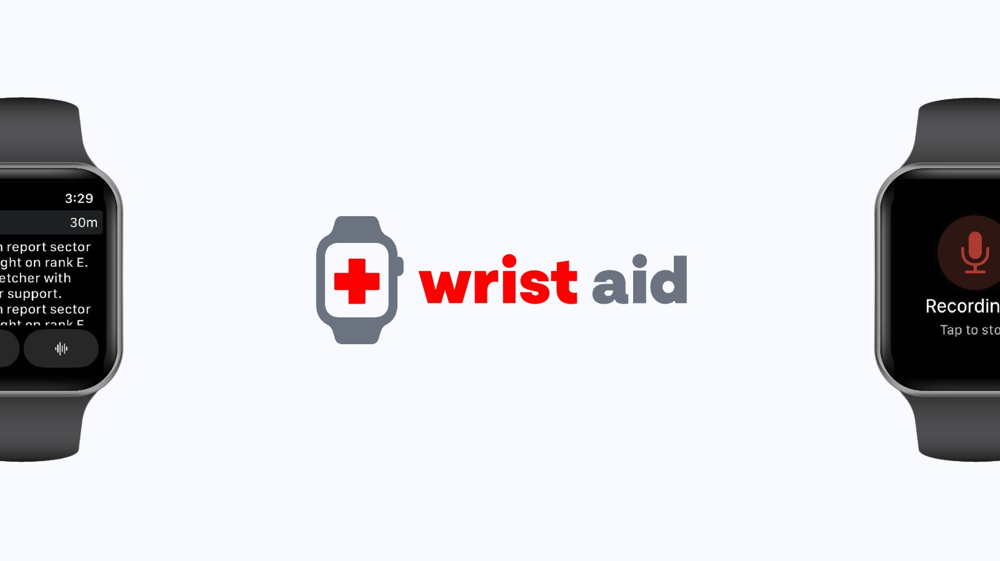

# Wrist-Aid

## Environment Variables

Create a `.env` file in the `backend` folder and fill in following API KEYS.

```
OPENAI_API_KEY=...  // API KEY for the OPENAI Services
AUDOAI_API_KEY=..   // API KEY for the Audo noice-canceling service
DEEPL_API_KEY=..    // API KEY for the Deepl Translation service (currently optional)
```

## WebSockets API

Server Side Messages

**Event**: NewMission
```javascript
{ 
  id: number;
  reportId: number;
  userId: number;   // user assigned for this mission
  done: boolean;    // is mission accomplished?
  latitude: number;   // location of the user who sent the report
  longitude: number;
  text: string;
  fileLocation: string;
}
```
**Event**: NewReport
```javascript
{
  reportId: number;
  fileLocation: string;
  text: string;
  userId: number;
  longitude: number;    // location of the user who sent the report
  latitude: number;
}
```

Client Side Events

**Event**: MissionDone

```javascript
{
  missionId: number;
}
```

**Event**: LocationUpdate

```javascript
{
  id: number; // die id des users der seine aktuelle postion sendet
  longitude: number;
  latitude: number;
}
```

## HTTP Api

You can find the swagger documentation of the http endpoint on `localhost:3000/api/swagger` after you started the server.